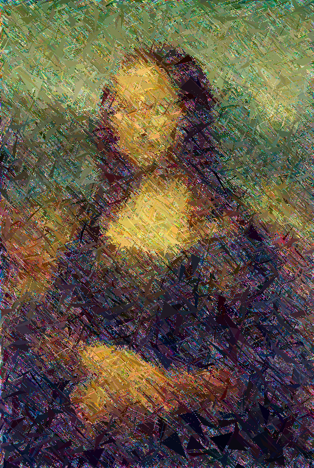

# AI_Art  
Takes an image as an input, then randomly generates triangles to replicate the image. Some examples below.

## Input Arguments  
AI_Art.exe takes 8 input arguments, alternatively give it 0 to be prompted for them, or enter -hc as the first argument to use hard-coded values in Program.cs.

FileIn (string): File path of input image  
FileOut (string): File path of output image  
Num (int): The number of triangles to generate initially  
MinLength (int): The minimum side length for triangles  
MaxLength (int): The maximum side length for triangles  
Granularity (int): The granularity to evaluate each triangle at  
DrawNum (int): The number of triangle to draw onto the final image  
Seed (int): Provide a random seed  

## Examples
Generated with: ./AI_Art MonaLisa.jpg MonaLisa-Out.bmp 2000000 5 30 3 50000 Will  
  

Generated with: ./AI_Art PearlEarring.jpg PearlEarring-Out.bmp 2000000 5 30 3 50000 Will  

Generated with: ./AI_Art LastSupper.jpg LastSupper-Out.bmp 2000000 5 10 1 100000 Will  

 
## Todo
1. General performace optimizations
2. Multithreading/parallelism
3. GPU offloading?
