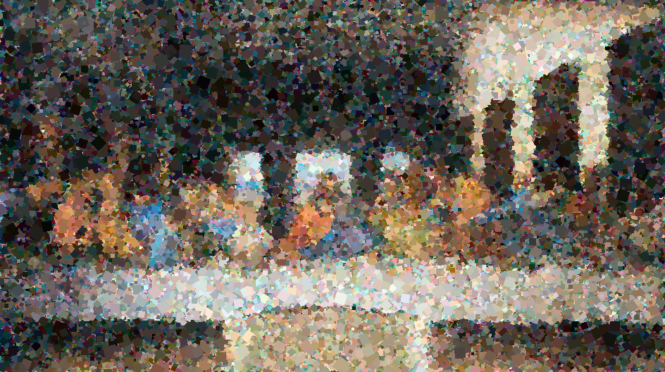
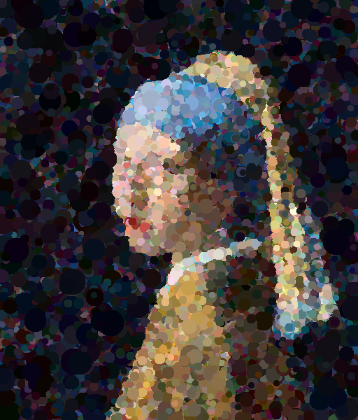

# AI_Art  
Takes an image as an input, then randomly generates shapes to replicate the image. Some examples below.

## Input Arguments  
AI_Art.exe takes 8 input arguments, alternatively enter -hc as the first argument to use hard-coded values in Program.cs.

* FileIn (string): File path of input image  
* FileOut (string): File path of output image  
* Type (int): The type of shape to generate  
	* 0 - Random Triangle  
	* 1 - Square  
	* 2 - Circle  
	* 3 - Regular Triangle  
* Num (int): The number of triangles to generate initially  
* DrawNum (int): The number of triangle to draw onto the final image  
* Granularity (int): The granularity to evaluate each triangle at  
	* 1 - Every pixel is evaluated  
	* 2 - Every 2nd pixel is evaluated  
	* 3 - Every 3nd pixel is evaluated, etc.  
* Seed (string): The hashcode of this string is used as the random number seed  
* MinLength (int): The minimum side length/radius for shapes  
* MaxLength (int): The maximum side length/radius for shapes  

## Examples
Generated with: ./AI_Art MonaLisa.jpg MonaLisa-Out.bmp 0 500000 100000 2 Will 5 20 
  

Generated with: ./AI_Art LastSupper.jpg LastSupper-Out.bmp 1 500000 100000 2 Will 5 20  

Generated with: ./AI_Art PearlEarring.jpg PearlEarring-Out.bmp 2 500000 100000 2 Will 5 20    

Generated with: ./AI_Art StarryNight.jpg StarryNight-Out.bmp 3 1000000 200000 2 Will 10 20    

 
## Todo
1. Multithreading/parallelism
2. More shapes
3. GPU offloading
